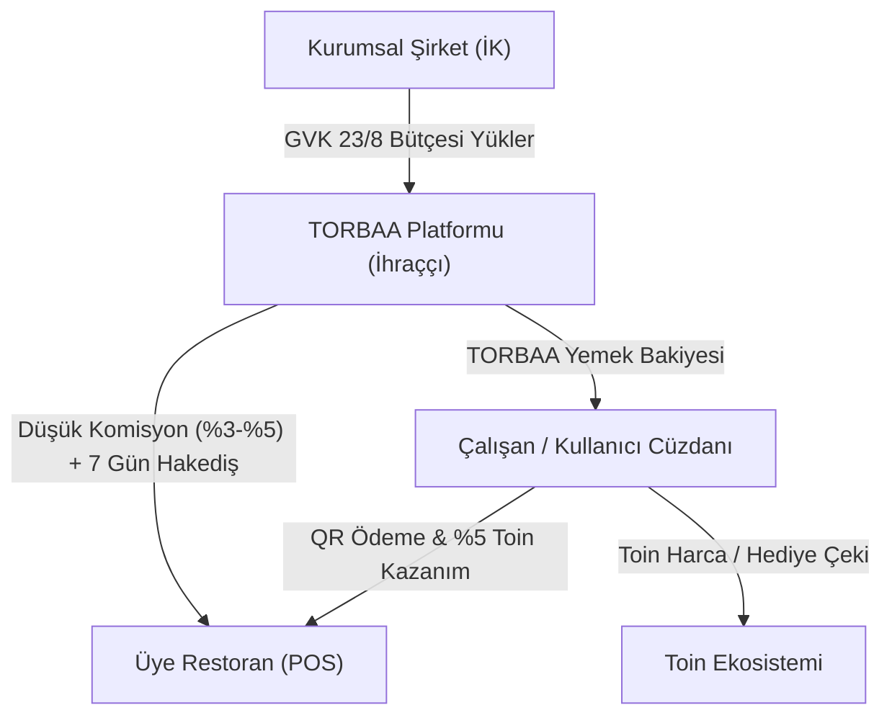

# TORBAA — Master Proje Spesifikasyon Dokümanı

> **Sürüm**: 2.0  
> **Tarih**: 22 Temmuz 2026  
> **Kapsam**: B2B2C Sadakat, Keşif, İşletme Paneli ve Özgün "TORBAA YEMEK KARTI" Ekosistemi

---

## 1. GİRİŞ VE SİSTEM MİMARİSİ

TORBAA; üçüncü taraf yemek kartı ihraççılarının yüksek komisyon yüklerine (%10-%12) bağımlı olmadan, **kendi yerli ve özgün "TORBAA YEMEK KARTI" markasını ihraç eden** uçtan uca bir B2B2C sadakat, keşif, e-ticaret ve kurumsal yan haklar platformudur.



### 1.1 Temel Aktörler ve Roller

1. **TORBAA Yemek Kartı İhraççısı (Takas & Yayıncı Kuruluş)**:
   - Kurumsal şirketlerle TORBAA Yemek Kartı sözleşmesi imzalar.
   - Üye restoranlara düşük komisyonlu (%3-%5) takas ve hakediş ödemelerini sağlar.
   - GVK 23/8 Vergi İstisnası faturalandırma ve raporlamasını yönetir.
2. **Mobil Tüketici / Şirket Çalışanı**:
   - Çipli 16 haneli dijital **TORBAA Yemek Kartı**'na sahiptir.
   - Yemek harcamalarında **%5 Toin** ekstra sadakat puanı kazanır.
3. **Üye Restoran & Bayi Sahibi**:
   - Anlaşmalı TORBAA Üye İşletmesi statüsündedir. Kasada QR kabul eder.
   - Biriken B2B Toin bakiyeleri ile TORBAA tedarik mağazasından sarf malzeme siparişi verir.
4. **Kurumsal Şirket İK Yöneticisi**:
   - Çalışanlarına aylık vergi istisnalı yemek bakiyesi ve özel gün primleri tanımlar.
5. **Kasiyer / POS Personeli**:
   - TORBAA Yemek Kartı QR Tahsilat Modu ile dinamik QR kod oluşturup ödemeyi alır.

---

## 2. İŞ KURALLARI VE DİJİTAL VARLIK MANTIĞI

### 2.1 "TORBAA YEMEK KARTI" Öz Ürün Kuralları
- **GVK 23/8 Vergi İstisnası**: Yüklenen yemek bakiyeleri %100 Gelir Vergisi ve SGK priminden istisnadır.
- **Çift Bakiye Cüzdanı (Dual Wallet)**:
  - `TORBAA Yemek Kartı Bakiyesi`: Anlaşmalı restoranlarda geçerli vergi istisnalı bütçe (TL).
  - `Toin Sadakat Bakiyesi`: Nakit değerli puan (`1 Toin = 1 TL`).
- **Çifte Kazanım**: TORBAA Yemek Kartı ile yapılan yemek ödemelerinde harcanan tutar üzerinden ekstra **%5 Toin** kazanılır.
- **Komisyon & Takas**: Restoranlardan %3-%5 komisyon alınır, 7 gün içinde banka hesabına aktarılır.

### 2.2 Sadakat & Seviye Motoru (Tier Engine)
- **Değer Denkliği**: `1 Toin = 1 TL`.
- **Bronz (0-499 TP)**: %5 Toin kazanımı.
- **Gümüş (500-999 TP)**: %7 Toin kazanımı + Özel indirimler.
- **Altın (1000-2499 TP)**: %10 Toin kazanımı + VIP müşteri hizmetleri.
- **Platin (2500+ TP)**: %15 Toin kazanımı + Çift Şans Çarkı hakkı.

---

## 3. VERİ MODELLERİ (TYPESCRIPT SCHEMAS)

```typescript
export interface User {
  id: string;
  phone: string;
  name: string;
  email?: string;
  avatar?: string;
  toinBalance: number;
  torbaaMealBalance: number; // TORBAA Öz Dijital Yemek Kartı Bakiyesi (TL)
  corporateInfo?: {
    companyId: string;
    companyName: string;
    employeeId: string;
    monthlyAllowance: number;
    cardNo: string; // Örn: 9876-1234-5678-0001
  };
  dailyEarned: number;
  lastEarnDate: string;
  tier: 'Bronze' | 'Silver' | 'Gold' | 'Platinum';
  tierPoints: number;
  spinAvailable: boolean;
  vouchers?: Voucher[];
}

export interface CorporateCompany {
  id: string;
  companyName: string;
  taxNo: string;
  taxOffice: string;
  address: string;
  employeeCount: number;
  monthlyMealBudgetPerEmployee: number;
  corporateToinBalance: number;
  torbaaContractNo: string;
}

export interface Merchant {
  id: string;
  name: string;
  category: string;
  image: string;
  address: string;
  distance: string;
  rating: number;
  isTorbaaMealMerchant: boolean;
  commissionRate: number; // Örn: 0.04 (%4)
  pendingSettlementTL: number;
  menu: MenuItem[];
  campaigns: Campaign[];
  monthlyTarget: number;
  monthlyProgress: number;
}

export interface Transaction {
  id: string;
  userId: string;
  merchantId: string;
  merchantName: string;
  type: 'earn' | 'spend' | 'torbaa_meal_pay';
  paymentMethod: 'torbaa_meal_card' | 'toin_balance' | 'credit_card';
  amount: number;
  toinAmount: number;
  date: string;
  description: string;
}
```

---

## 4. SAYFA SPESİFİKASYONLARI VE ROTALAR

### 4.1 Mobil Uygulama (`/mobile/...`)
- `/mobile/login`: Telefon numarası & OTP doğrulama ekranı.
- `/mobile/explore`: Restoran/Mağaza arama, filtreler, *"TORBAA Yemek Kartı Geçen Yerler"*, Seviye kartı, 7 günlük streak.
- `/mobile/merchant/[id]`: İşletme detay, menü, sepete ekleme, kampanya detayları.
- `/mobile/qr`: Ödeme yöntemi seçimi (TORBAA Yemek Kartı / Toin Harca / Toin Kazan %5), QR tarayıcı & token girişi.
- `/mobile/wallet`: Dijital 16 haneli çipli TORBAA Yemek Kartı widget'ı, Çift Bakiye, Hediye Çekleri Pazarı, P2P Transfer.
- `/mobile/profile`: Seviye rozetleri, başarım rozetleri grid'i, oturum kapatma.
- `/mobile/campaigns`: Kampanya listesi.

### 4.2 İşletme Paneli (`/panel/...`)
- `/panel/login`: İşletme giriş ekranı.
- `/panel/dashboard`: Ciro, TORBAA hakediş alacağı, Hızlı POS Kasiyer QR Tahsilat Modalı.
- `/panel/balance`: Hakediş ödeme takvimi, banka hesabı aktarımı, B2B Toptan Tedarik Mağazası.
- `/panel/transactions`: Günlük ve aylık tahsilat listesi.
- `/panel/campaigns`: İşletmeye özel kampanya oluşturma.

### 4.3 Kurumsal İK Portalı (`/corporate/...`)
- `/corporate/dashboard`: Şirket çalışanlarına toplu TORBAA Yemek Kartı yükleme, GVK 23/8 Vergi İstisna Raporu (SGK ve Gelir Vergisi tasarruf dökümü).

---

## 5. API SPEKLERİ

- `POST /api/auth/otp/verify`: OTP doğrulama & kullanıcı oturumu.
- `GET /api/merchants/nearby`: Üye işletmeler listesi.
- `POST /api/qr/meal-pay`: TORBAA Yemek Kartı bakiyesinden harcama + %5 Toin tanımlama.
- `POST /api/corporate/allowance`: Çalışanlara toplu bakiye aktarımı.
